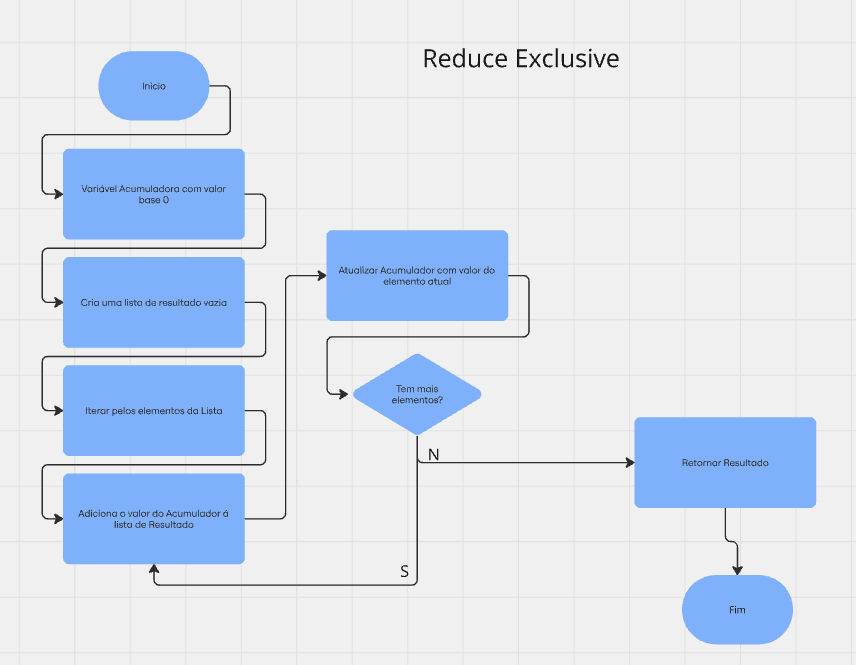
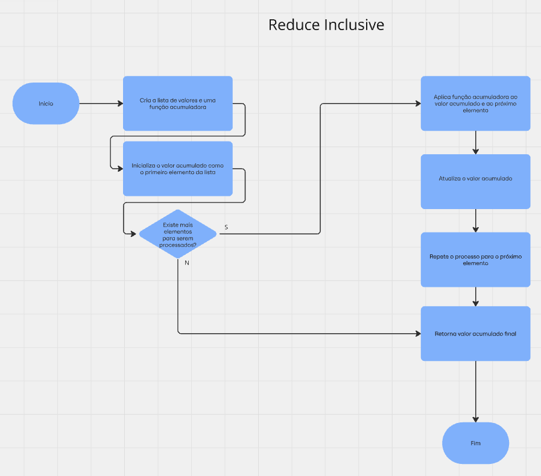
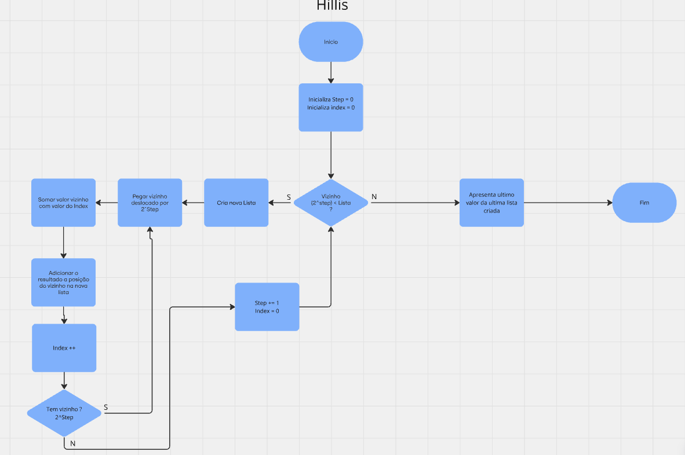
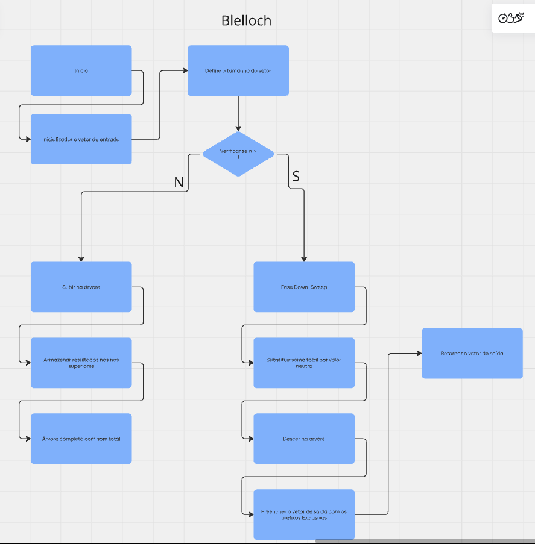
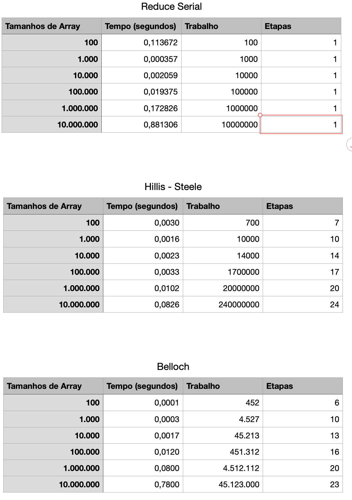

# Descrição Atividade
Considere os seguintes algoritmos para operações de redução em paralelo: Reduce Serial (exclusivo/inclusivo), Hillis-Steele, e Blelloch.

a) Elabore um fluxograma que represente o funcionamento programável de cada um desses algoritmos.

b) Implemente o algoritmo Reduce Serial para diferentes tamanhos de array: 100, 1.000, 10.000, 100.000, 1.000.000 e 10.000.000. Registre os tempos de execução e analise o desempenho conforme o aumento do tamanho do array.

c) Implemente o algoritmo de Hillis-Steele para os mesmos tamanhos de array e registre o tempo de execução, a quantidade de trabalho realizada e o número de etapas (passos) necessárias.

d) Repita o mesmo procedimento para o algoritmo de Blelloch, registrando o tempo, o trabalho e o número de passos para cada tamanho de array.

e) Construa uma tabela comparativa com os resultados obtidos para os três algoritmos, incluindo tempo de execução, quantidade de trabalho e número de passos.

f) Interprete os dados apresentados na tabela e analise as diferenças de desempenho entre os algoritmos, discutindo como o tempo, o trabalho e o número de passos variam conforme o tamanho do array e as características de cada algoritmo.

## Fluxogramas
  
  
  
  
  

## Implementação dos Algoritmos

[Reduce Serial](https://github.com/ArthurRCastilho/Programacao-Paralela/blob/main/atividades/Implementa%C3%A7%C3%A3o%20Reduce%2C%20Hills%20e%20Blelloch/letra_b.ipynb)  
[Hillis-Steele](https://github.com/ArthurRCastilho/Programacao-Paralela/blob/main/atividades/Implementa%C3%A7%C3%A3o%20Reduce%2C%20Hills%20e%20Blelloch/letra_c.ipynb)  
[Blelloch](https://github.com/ArthurRCastilho/Programacao-Paralela/blob/main/atividades/Implementa%C3%A7%C3%A3o%20Reduce%2C%20Hills%20e%20Blelloch/letra_d.ipynb)  

## Tabela Comparativa

## Discusão sobre a Atividade

1. Reduce Serial
- Descrição: O algoritmo Reduce Serial realiza a soma sequencial dos elementos do array. Ele é o mais simples dos três, pois não possui paralelismo e realiza a operação em uma única etapa (Etapas = 1 para todos os tamanhos de array).
- Tempo de execução: Observamos que o tempo de execução cresce linearmente conforme o aumento do tamanho do array, o que é esperado para um algoritmo sequencial. Esse crescimento ocorre porque o trabalho (ou número total de operações) aumenta proporcionalmente ao número de elementos no array.
- Trabalho e Etapas: O trabalho é proporcional ao número de elementos do array, uma vez que cada elemento é processado uma vez. Como o algoritmo é sequencial, o número de etapas é sempre 1.  

2. Hillis-Steele
- Descrição: O algoritmo Hillis-Steele utiliza uma abordagem paralela para reduzir o array. Ele realiza várias etapas, nas quais o número de operações por etapa diminui exponencialmente à medida que os elementos são combinados.
- Tempo de execução: O algoritmo apresenta um aumento no tempo de execução conforme o tamanho do array cresce, mas o crescimento é mais moderado comparado ao Reduce Serial. Para grandes arrays, como 10.000.000 de elementos, o tempo é significativamente menor que o do algoritmo serial, devido ao paralelismo.
- Trabalho e Etapas: O trabalho é maior que o do Reduce Serial porque cada elemento é processado várias vezes em diferentes etapas. O número de etapas aumenta logaritmicamente em relação ao tamanho do array, indicando que o algoritmo é eficiente para grandes arrays, mas pode ter sobrecarga adicional em arrays menores.  

3. Blelloch
- Descrição: O algoritmo Blelloch, também conhecido como Blelloch Scan ou Blelloch Parallel Prefix, é uma implementação paralela otimizada para reduzir o número de operações em comparação com Hillis-Steele. Ele divide o processo em duas fases: a fase de subida (onde as somas parciais são calculadas) e a fase de descida (onde os resultados finais são obtidos).
- Tempo de execução: O Blelloch é o algoritmo mais rápido para arrays menores (100, 1.000, 10.000), mas seu tempo de execução se aproxima dos outros algoritmos à medida que o tamanho do array aumenta. Para arrays grandes, ele ainda mantém um desempenho melhor em comparação ao Reduce Serial, mas é mais lento que Hillis-Steele em tamanhos maiores, como 10.000.000.
- Trabalho e Etapas: A quantidade de trabalho é otimizada, sendo menor que o Hillis-Steele para tamanhos menores de array, mas cresce significativamente para tamanhos maiores. O número de etapas é similar ao Hillis-Steele, com um aumento logarítmico em relação ao tamanho do array.  

4. Conclusão
- Para a tarefa de somar grandes arrays, os algoritmos paralelos são muito mais eficientes do que o algoritmo sequencial. A escolha entre Hillis-Steele e Blelloch pode depender do tamanho do array e dos recursos computacionais disponíveis. Blelloch é preferível para arrays menores, enquanto Hillis-Steele apresenta melhor desempenho para arrays muito grandes devido à sua capacidade de reduzir a sobrecarga de operações adicionais.