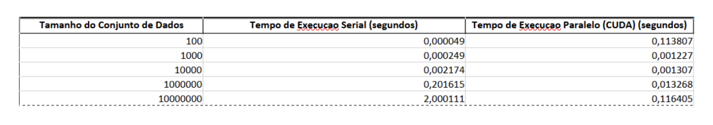

# Programação Paralela

### Aula 06

### Atividade 01

    A)  Elabore uma descrição e uma exemplificação para 6 números.
O Radix Sort é um algoritmo de ordenação que utiliza as casas decimais (ou dígitos) de cada número de forma sequencial para ordenar os elementos. Ele organiza os números de acordo com os seus dígitos, começando do dígito menos significativo (a unidade) até o dígito mais significativo.

Exemplo:
Considere os seguintes 6 números:
170, 45, 75, 90, 802, 24

Passo 1: Ordenar pela unidade (dígito de 1º posição):
170, 802, 24, 45, 75, 90

Passo 2: Ordenar pela dezena:
802, 24, 45, 75, 170, 90

Passo 3: Ordenar pela centena (dígito mais significativo):
24, 45, 75, 90, 170, 802

Portanto, a lista ordenada é:
24, 45, 75, 90, 170, 802

Ordenar pelo dígito menos significativo (unidade), mantendo a ordem relativa dos outros dígitos.
Ordenar pelo próximo dígito (dezena), mantendo a ordem relativa dos números anteriores.
Continuar até o dígito mais significativo.

    B) Elabore um fluxograma para implementação serial e para Paralela

 

<figure>

  

 

<figure>

  

 

    C) Realize a implementação serial para os seguintes casos: 100 | 1000 | 10000 | 100000 | 10000000

- [Repositório com o código](https://github.com/KayssonGabriel/RadixSerial)

 

    D) Considere a letra “c" de forma paralelizada 

- [Repositório com o código](https://github.com/KayssonGabriel/RadixParalelo)

 

    E) Elabore a tabela comparativa “entre a c e a d”

<figure>

  

